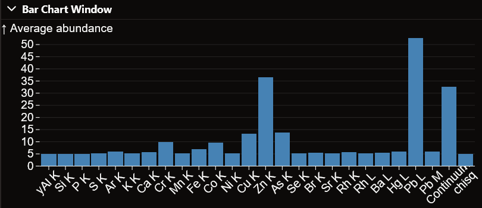

Bar Chart
=============

In this section you can find how to use the bar chart visualization window.

Global elemental average
------------------------
Upon loading the window, the global elemental average is computed and displayed.
This corresponds to the average abundance of each element accross the entire painting.

Selection elemental average
---------------------------
When making a selection on the painting, either with the area selection tool, elemental selection, or color selection, the elemental average of the selection will be computed.
This is the average abundance of each element accross the selection.

Example
-------

Here the global elemental average is displayed.