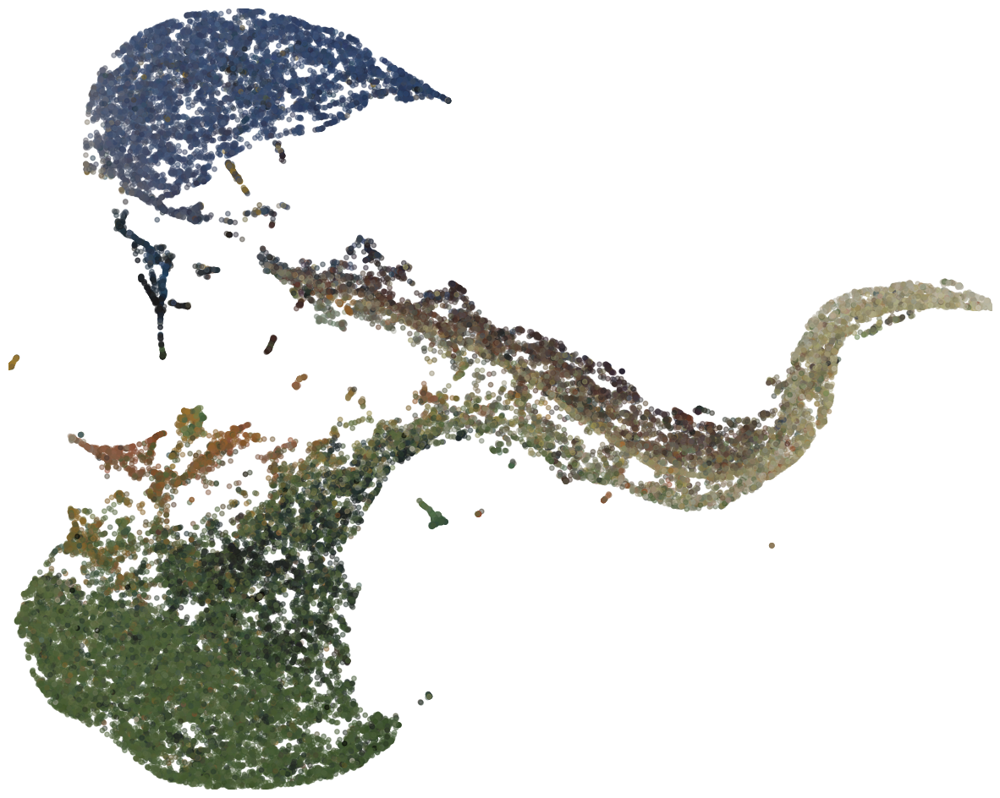

Dimensionality Reduction
=============

In this section you can find how to use the dimensionality reduction window.

Create embedding
------------------------
Upon loading the window, the user is shown some options. When no embedding has been created yet, the user has to create one. For this, first select an overlay from the dropdown menu. Next, select an element and threshold. The threshold is used to select all pixels in the elemental data cube for which the given element has a normalized intensity above the threshold. 

However, for some threshold the number of pixels that satisfy the condition is larger than the maximum allowed of pixels used for the dimensionality reduction. To combat this, the server will down sample the data to the maximum allowance. When this happens, a pop-up message will appear indication that the data has been down sampled. 

Finally, after some time, the user will be shown the embedding. For example, when the threshold is turned to 0 (element does not matter in this case), one can get the following embedding:

Show overlay
---------------------------
When having generated an embedding, the user can show a different overlay on top. For this simply select the overlay from the dropdown menu and click the show overlay button.

Use the lasso tool 
---------------------------
When showing an embedding image, the user can use the lasso tool to see the relation between the main viewer and ...