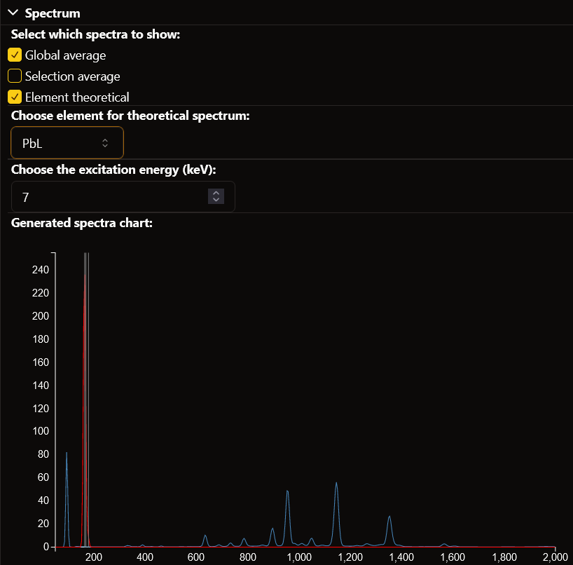

Spectra Chart
=============

In this section you can find how to use the spectra chart visualization window.

Global Average Spectrum
-----------------------

A few seconds after loading the window, the global average spectrum will be computed. 
This is the spectrum of the average intensity per energy bin accross the entire painting. 
The energy bins are computed between the low and high boundaries and with the bin size specified upon loading the raw file.

The spectrum can be made visible on the chart by ticking the **global average checkbox**.

Selection Average Spectrum
--------------------------

When making a selection on the painting, either with the area selection tool, elemental selection, or color selection, the average spectrum of the selection will be computed.
This is the spectrum of the average intensity per energy bin accros the selected parts of the painting.
The energy bins are computed between the low and high boundaries and with the bin size specified upon loading the raw file.

The spectrum can be made visible on the chart by ticking the **selection average checkbox**.

Element theoretical Spectrum and Peaks
--------------------------------------

The spectra chart also allows to visualize the theoretical spectrum and intensity peaks of an element to compare with the real data.
The theoretical intensity peaks are represented as gray vertical lines at their corresponding energy values. They are always visible when their element is selected.
The spectrum is the theoretical intensity of the element and excitation energy per energy bin, retrieived from the *xrf4u* and *xraydb* libraries.
The energy bins are computed between the low and high boundaries and with the bin size specified upon loading the raw file.

An element can be selected in the **element dropdown** together with an excitation energy in the **excitation input field**.
The spectrum can be made visible on the chart by ticking the **element theoretical checkbox**.

Example
-------

Here the global average spectrum is selected, and thus displayed in blue. 
The theoretical elemental spectrum is also selected, with element lead and excitation 7. It is shown in red, with the peak also being shown as gray vertical lines.
The selection spectrum is not selected and therefore not shown.

